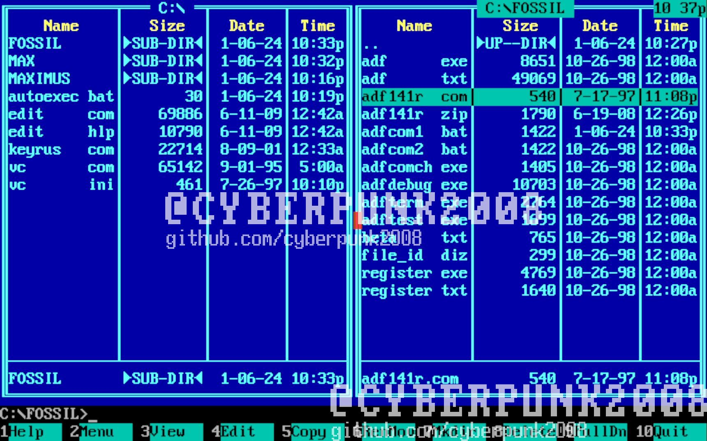
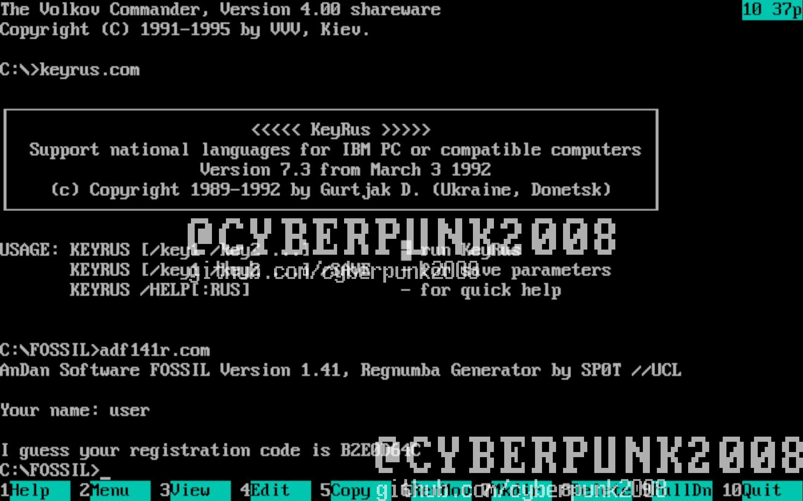
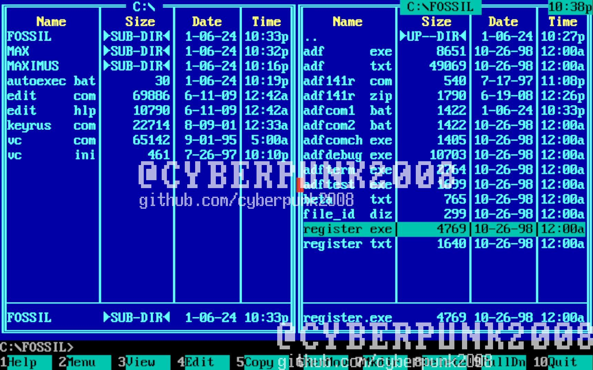
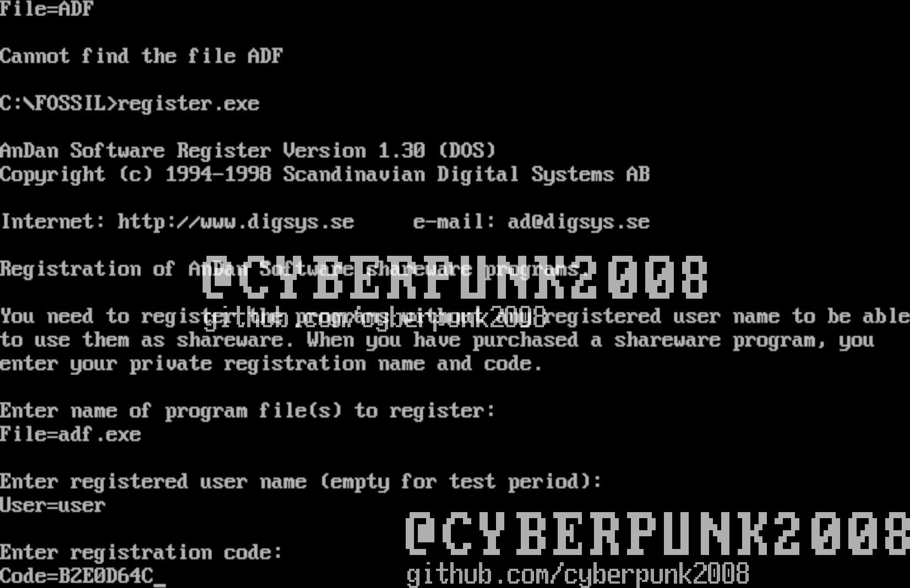
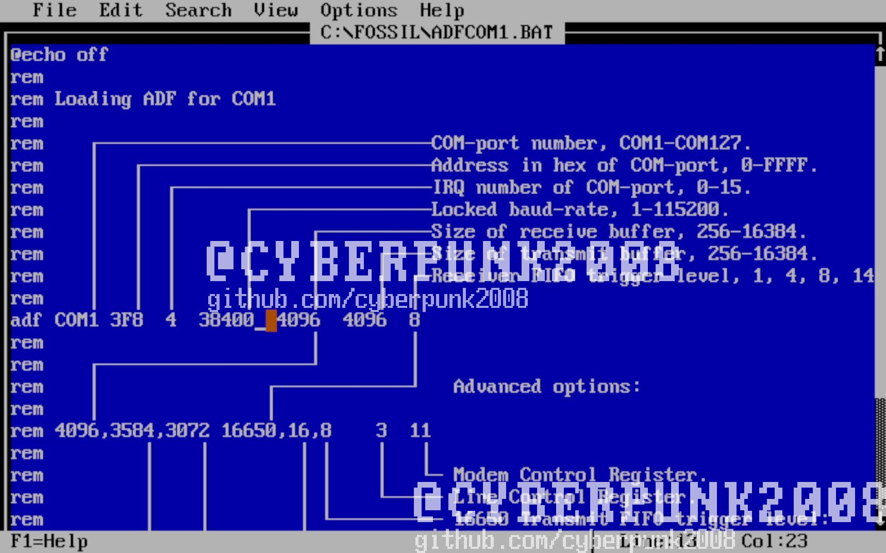
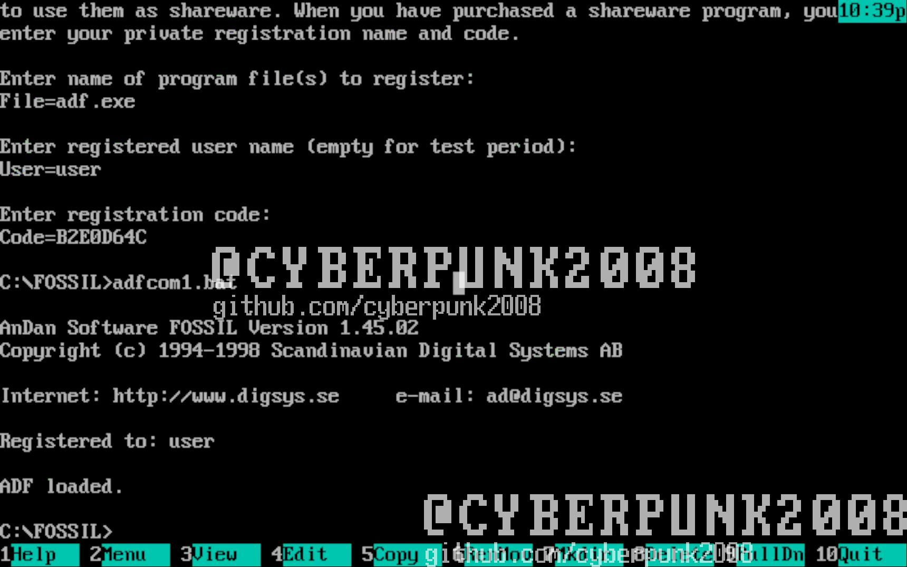

# Настройка драйвера Fossil

1. Активация программы запускаем adf141r.com

1. В поле Your name : пишем свое имя запоминаем его и записываем ключ
регистр имеет значение

1. Запускаем Register.exe

1. Вводим adf.exe потом имя и ключ

1. Откываем файл в текстовом редакторе ADFCOM1.Bat или ADFCOM2.bat смотря
в какой порт установлен модем Locked baud-rate ставим значение, которое
выбрали в Maximus BBS по умолчанию максимальное значение которое можно
выбрать при установке макса 38400 Бод

1. Сохраняем файл после этого можем запускать ADFCOM1.Bat или
ADFCOM2.bat. На этом настройка драйвера подошла к концу

