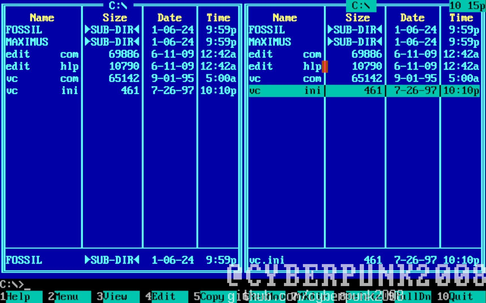
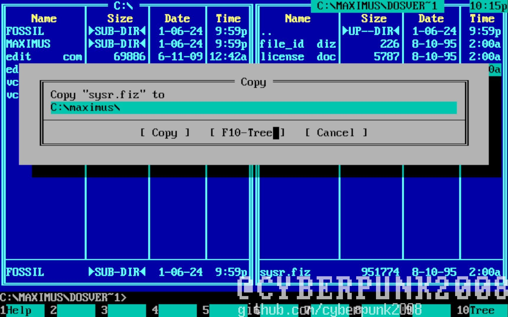
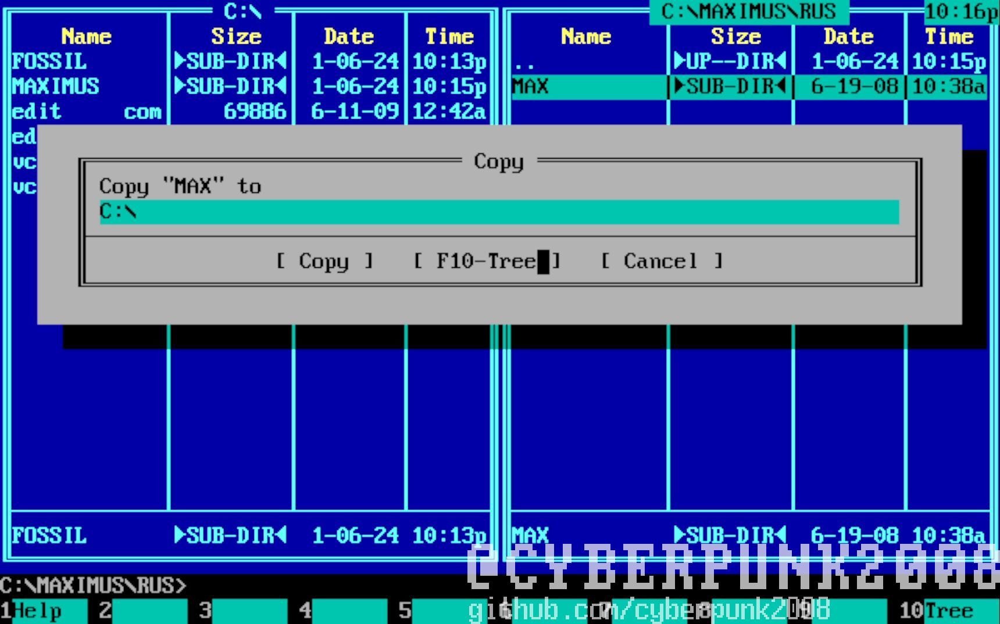
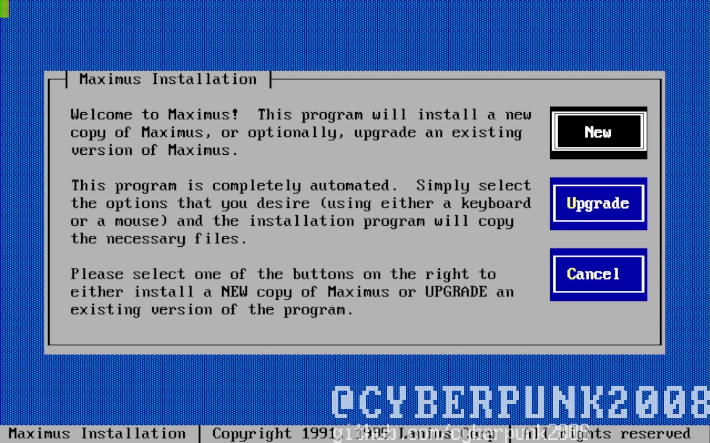
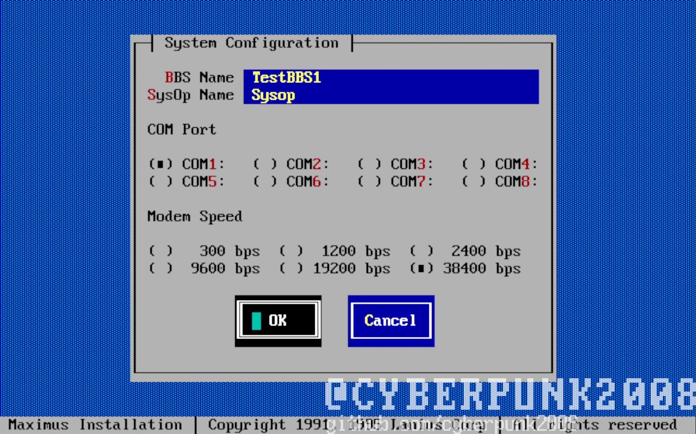
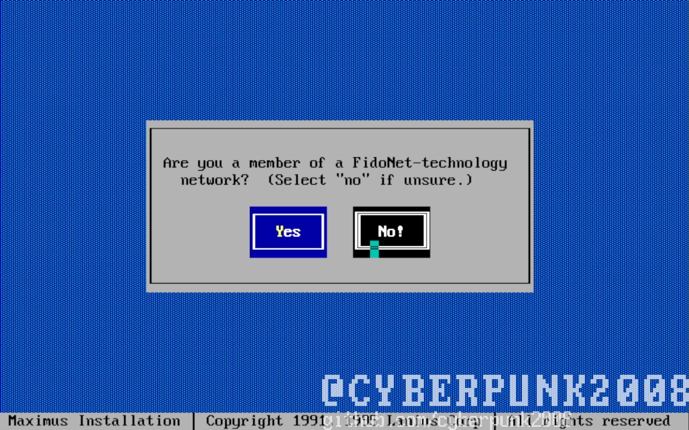
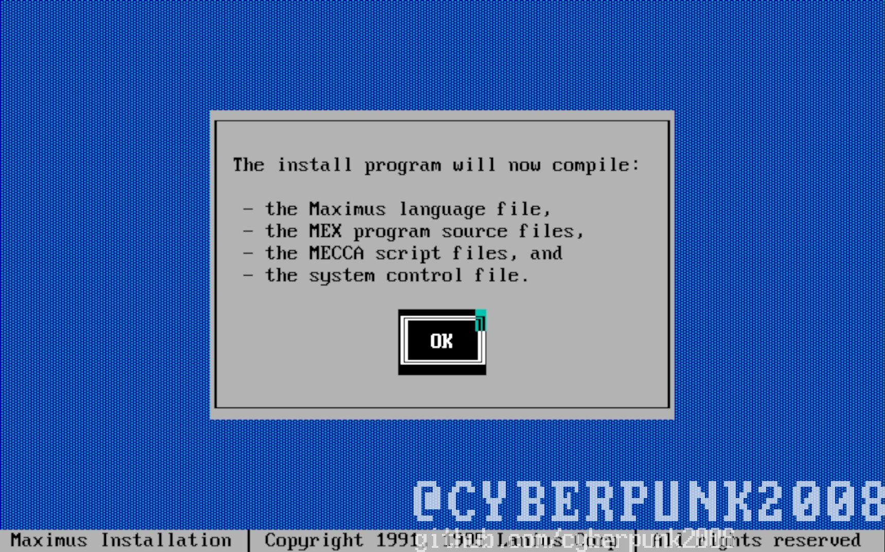
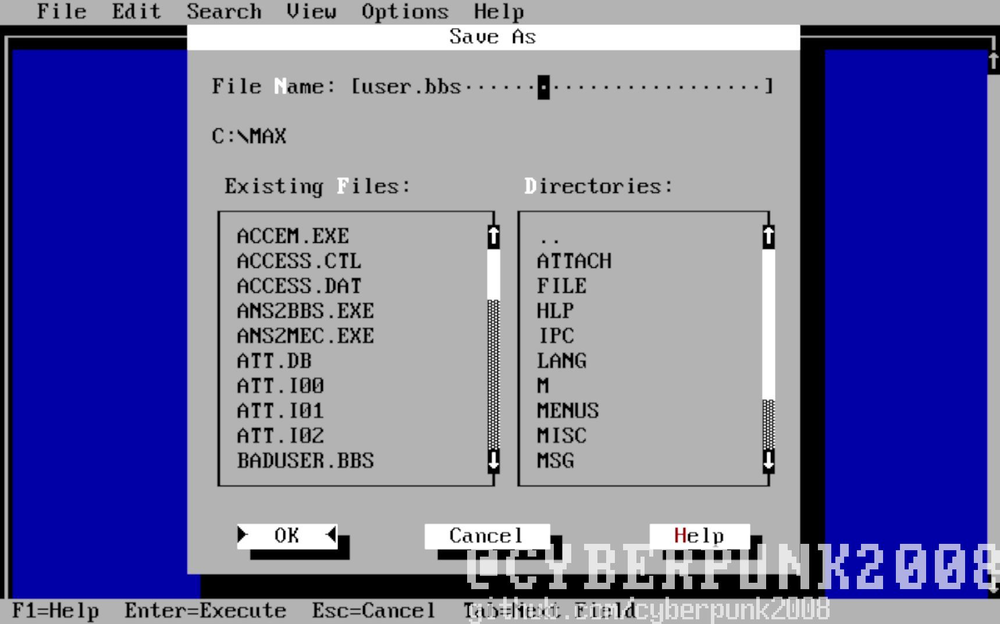

# Установка Maximus BBS

1. Измените имя папки с установщиком на
Maximus

1. Копируем файл из c:\\maximus\\dosver\\Sysr.fiz по пути C:\\maximus\\

1. Копируем папку MAX из C:\\maximus\\rus\\ в корень диска C:\\

1. Запускаем Install.exe из c:\\maximus\\нажимаем New

1. Нажимаем ОК!

1. Нажимаем Yes!

1. Пишем имя, и имя сисопа выбираем com порт скорость порта ставим
максимальную

1. Нажимаем No

1. Просто ждем до этого экрана нажимаем OK

1. Далее ждем конца установки. После открываем текстовый редактор
создаем пустой текстовый файл с расширением .bbs и именем user сейвим
его по пути c:\\max

1. Установка завершена, осталось только зарегатся на BBS
