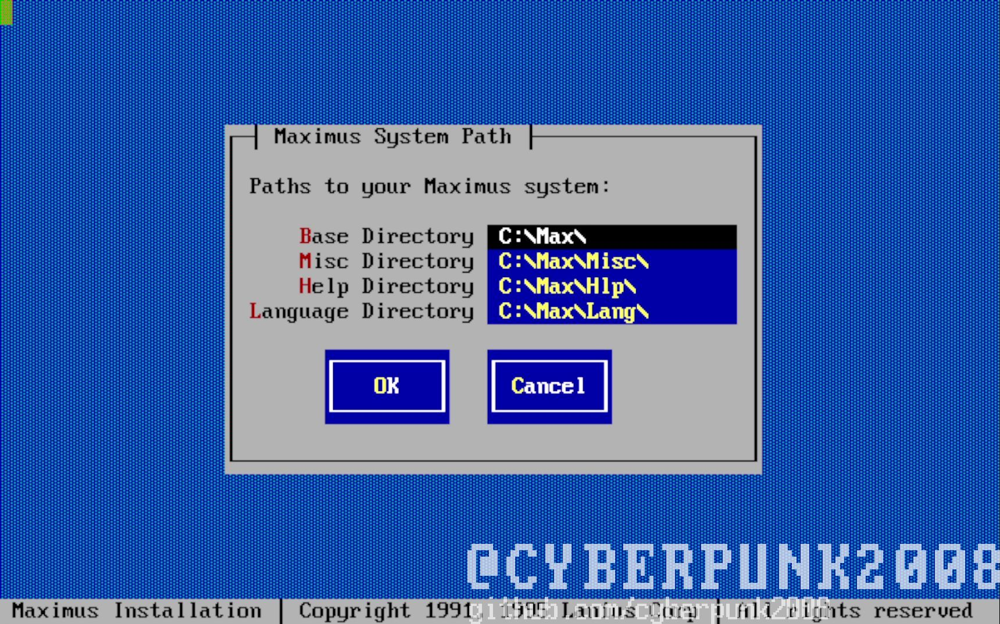
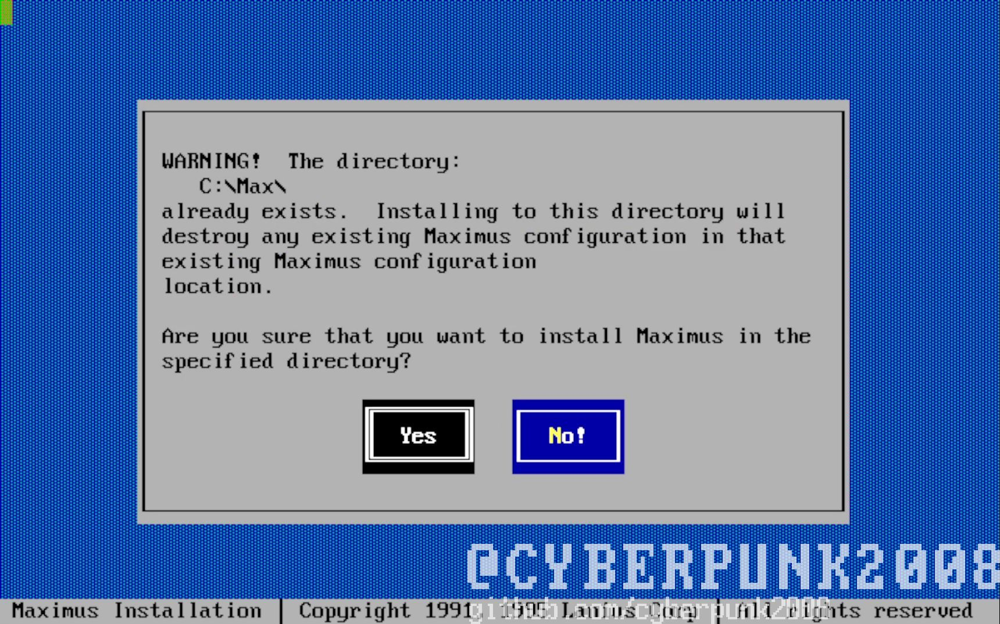

Установка Maximus BBS

1\. Измените имя папки с установщиком на
Maximus

2.Копируем файл из c:\\maximus\\dosver\\Sysr.fiz по пути C:\\maximus\\

3.Копируем папку MAX из C:\\maximus\\rus\\ в корень диска C:\\

4.Запускаем Install.exe из c:\\maximus\\нажимаем New

5.Нажимаем ОК

6.Нажимаем Yes

7.Пишем имя, и имя сисопа выбираем com порт скорость порта ставим
максимальную

8.Нажимаем No

9.Просто ждем до этого экрана нажимаем OK

10.Далее ждем конца установки. После открываем текстовый редактор
создаем пустой текстовый файл с расширением .bbs и именем user сейвим
его по пути c:\\max

11.Установка завершена, осталось только зарегатся на BBS
