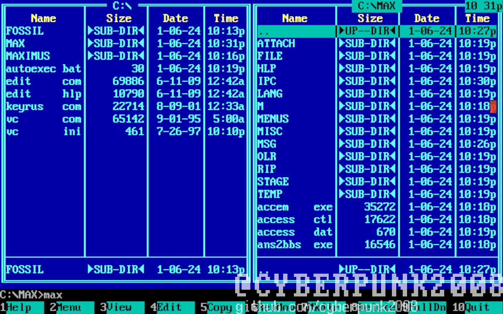
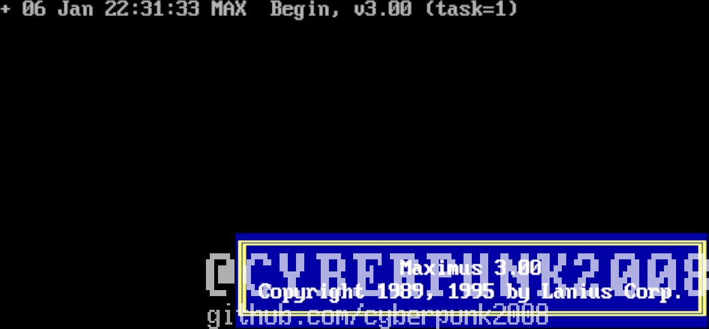
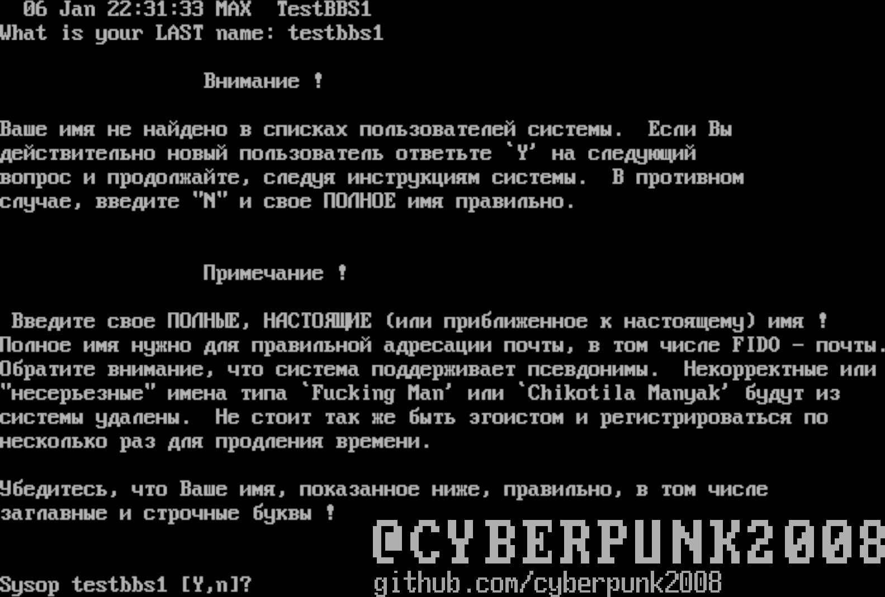
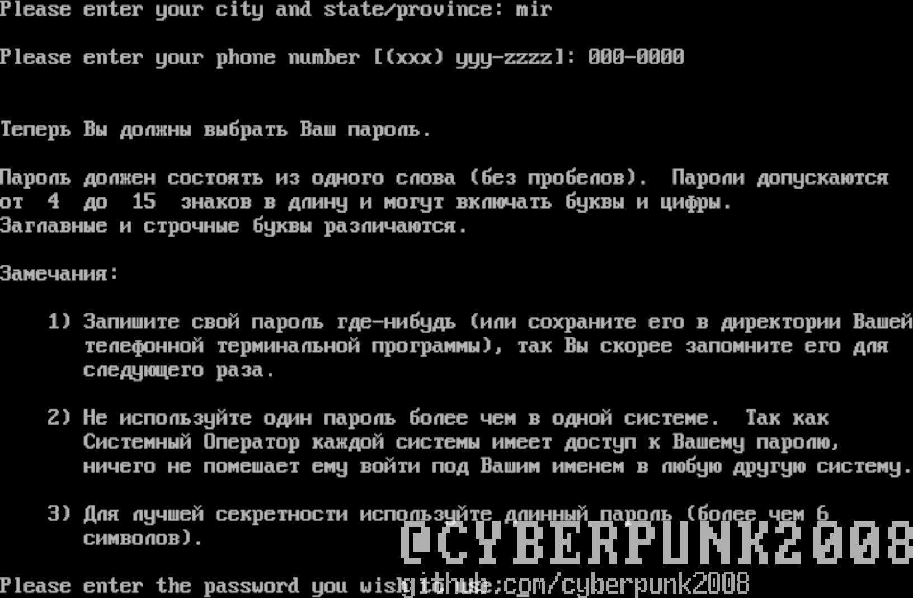
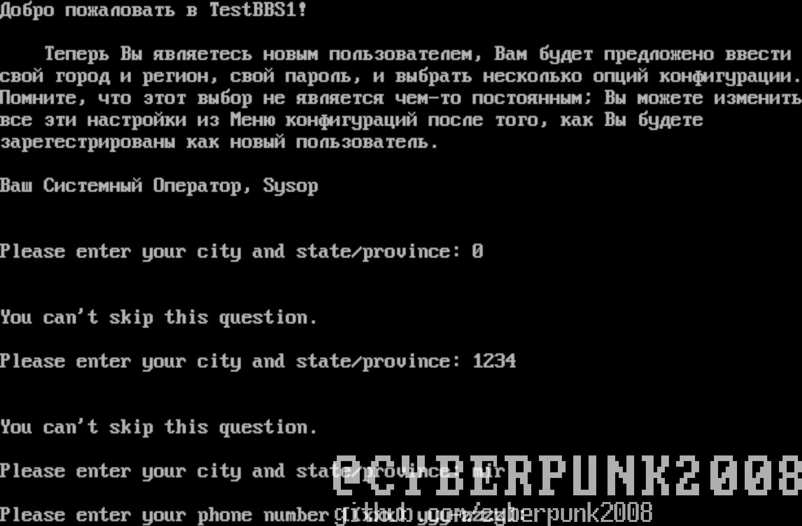
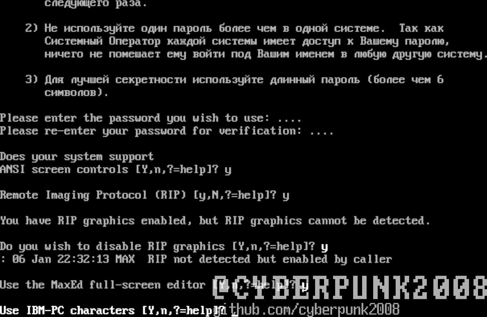
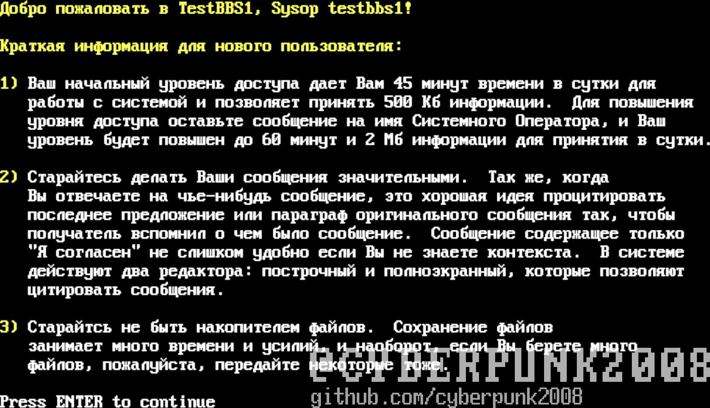
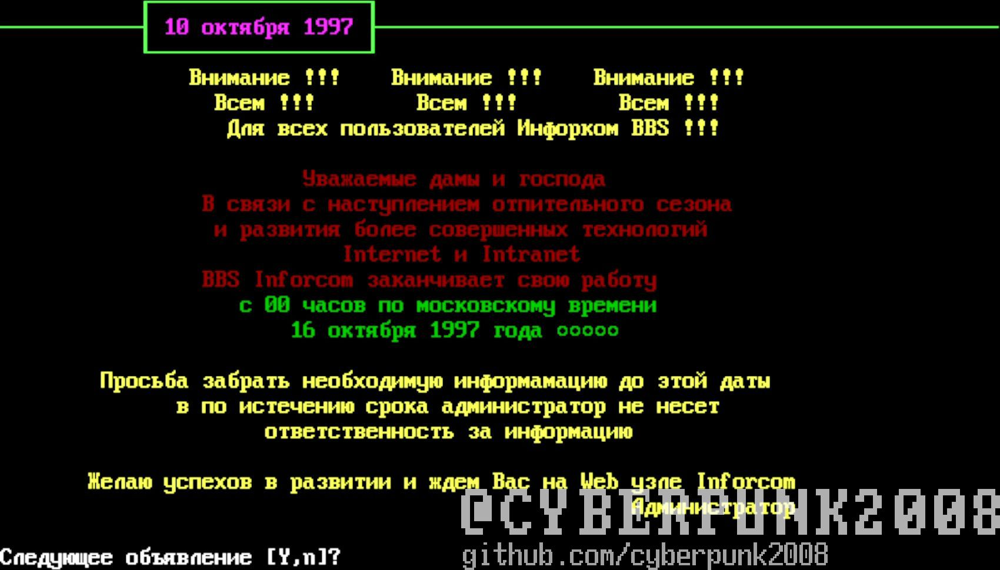

# Настройка Maximus BBS

1. Запускаем keyrus.com потом идем в
c:\\max\\max.exe

1. Enter вроде

1. Вводим имя, нажимаем Enter

1. Y

1. Вводим ваш город у меня как пример mir

1. Пишем номер телефона BBS

1. Далее просто Y много раз

1. Enter

1. Далее просто Y

Для запуска BBS Запускаем FOSSIL ADFCOM1 или ADFCOM2 заходим в
C:/max/runbbs.bat и у вас своя ббс о компиляторе расскажу чуть позже
