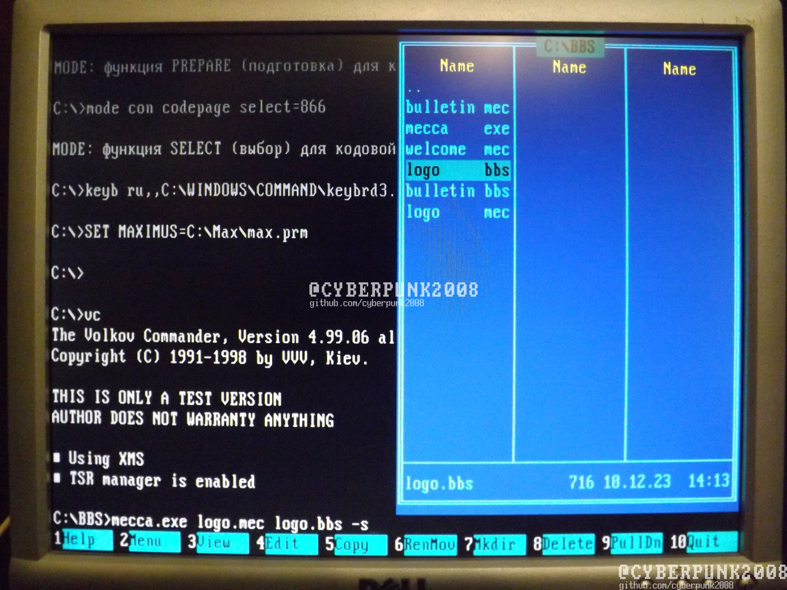
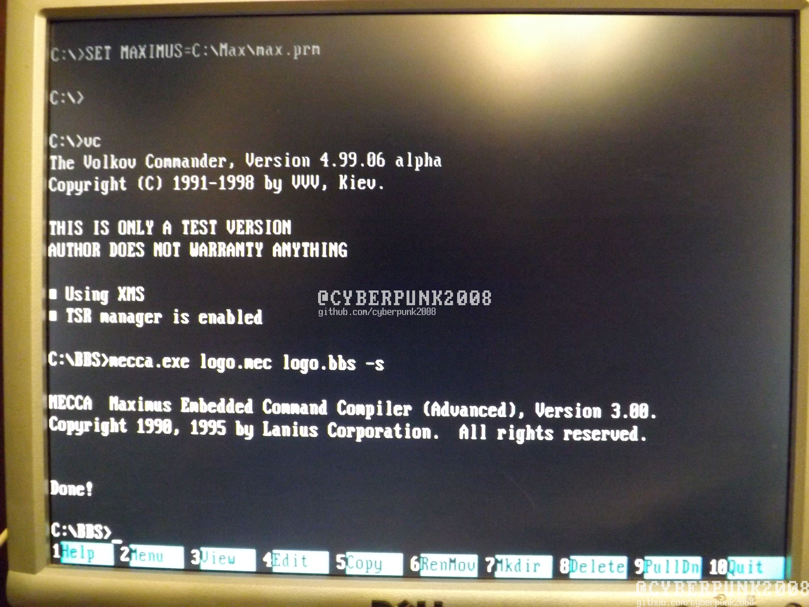
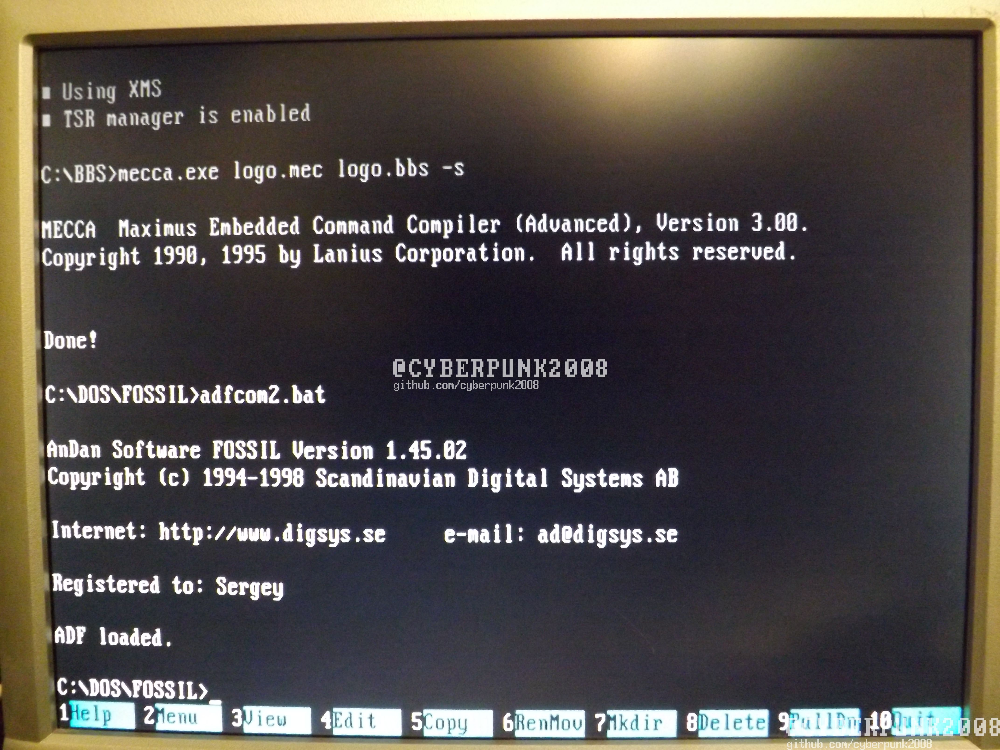
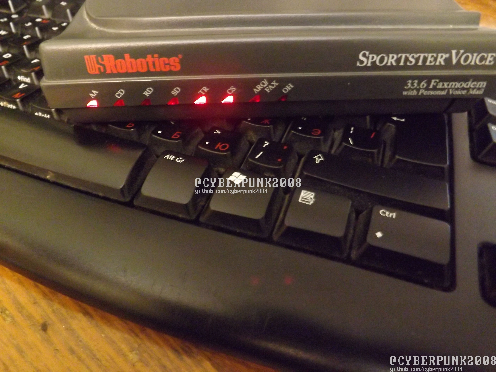
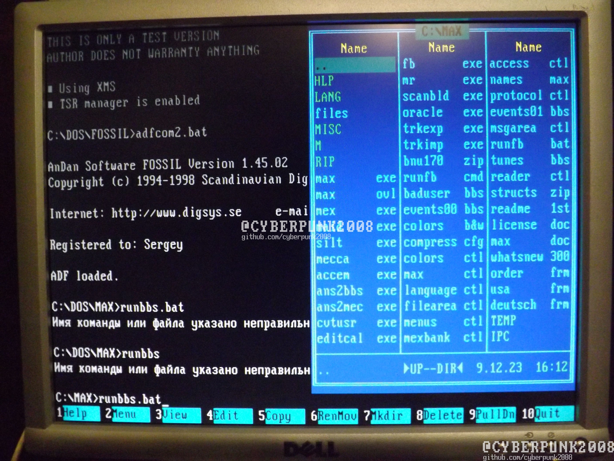
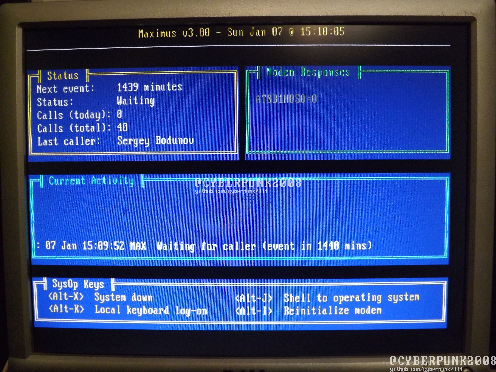
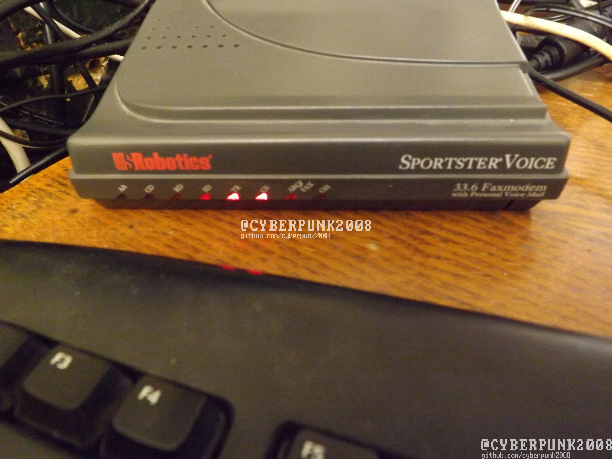

1.По пути c:/maximus/rus/max/misc/ есть файлы с расширением .mec это не
компилированные файлы bbs при установке они будут скомпилированы в файлы
.bbs сейчас я покажу пример редактирования файла для этого его нужно
просто открыть в текстовом редакторе 

2.Компилятор лежит в папке макса файл mecca.exe для того чтобы
скомпилировать файл нужно написать mecca.exe имя.mec имя.bbs –s у меня
как пример logo в место имя компилятор можно кинуть в c:\\max\\misc\\

3.На выходе получаем такое сообщение 

4.Настало время самого интересного в нашем эээксперементе. Запускаем
драйвер у меня модем в порту COM2
Adfcom2.bat

5.Модем 

6.Запускаем BBS 

9.В поле Modem Responses видим команды посылаемые модему

10.фото модема после запуска программы

