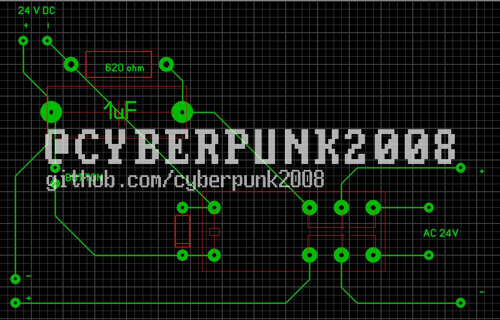

1.Приставка для соединения модемов без АТС с левой стороны подключается
клиент, с правой - модем, на который мы будем звонить. Для вызова нужно
набрать в программе терминал команды ATX1, чтобы модем игнорировал
отсутствие тона в линии, и ATDT1 для вызова. Для того чтобы второй модем
принял звонок, нужно нажать на кнопку "Button" на модеме загорится AA
(Auto Answer). Первоисточники:

<https://www.jagshouse.com/modem.html>

<https://wiki.compowiki.info/%D0%A1%D0%BE%D0%B5%D0%B4%D0%B8%D0%BD%D0%B5%D0%BD%D0%B8%D0%B5%D0%94%D0%B2%D1%83%D1%85%D0%9C%D0%BE%D0%B4%D0%B5%D0%BC%D0%BE%D0%B2>
